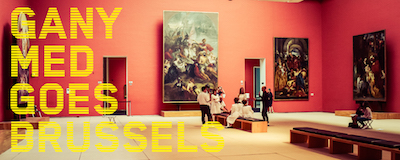

# Speelseizoen sept 2019-juni 2020

## Opera/Concerten Koor

* "Don Carlos" (G. Verdi), met [Opera Vlaanderen](https://operaballet.be/nl), sept-okt 2019, Opera Antwerpen en Gent.
* "Messa di Requiem" (G. Verdi), met [Opera Vlaanderen](https://operaballet.be/nl), 5 okt 2019 Sint-Baafskathedraal Gent, 8 okt 2019 deSingel Antwerpen.
* "Macbeth" (G.Verdi), met [Opera Vlaanderen](https://operaballet.be/nl), november 2019, Opera Gent en Opera Groothertogdom Luxemburg.
* "Der Schmied von Gent" (F. Schreker), met [Opera Vlaanderen](https://operaballet.be/nl), feb-maart 2020, Opera Antwerpen en Gent.
* "C(H)OEURS 2020", met [Opera Vlaanderen](https://operaballet.be/nl) en Les Ballets C de la B, maart-april 2020, Opera Gent en Antwerpen.

# Speelseizoen sept 2018-juli 2019

## Opera/Concerten Koor

* "Klassiek in de Stad", met [Opera Vlaanderen](https://operaballet.be/nl), 2 sept '18, openluchtconcert om 11u30 op St.-Jansplein, Antwerpen.
* "Lohengrin" (R. Wagner), met [Opera Vlaanderen](https://operaballet.be/nl), sept-okt '18, Opera Gent en Antwerpen.
* "For the Fallen", concert met Vlaams Radio Koor en Brussels Philharmonic, 16 nov '18, Flagey Brussel.
* "Les Pêcheurs de perles" (G. Bizet), met [Opera Vlaanderen](https://operaballet.be/nl), dec '18-jan '19, Opera Antwerpen en Gent.
* "Cardillac" (P. Hindemith), met [Opera Vlaanderen](https://operaballet.be/nl), februari-maart '19, Opera Antwerpen en Gent.
* "La Juive" (J. Halévy), met [Opera Vlaanderen](https://operaballet.be/nl), maart-april '19, Opera Antwerpen en Gent.
* "Les Pêcheurs de perles" (G. Bizet), met [Opera Vlaanderen](https://operaballet.be/nl), mei '19, Opera Groothertogdom Luxemburg.
* "Macbeth" (G. Verdi), met [Opera Vlaanderen](https://operaballet.be/nl), juni-juli '19, Opera Antwerpen.

## Solo-Concerten

* "Ganymed goes Brussels", Performance, 11,18, 25 okt; 8, 15, 22 nov; 11 dec '18, Museum voor Schone Kunsten Brussel. <https://fine-arts-museum.be/nl/ganymedgoesbrussels>

# Speelseizoen sept 2017-juni 2018

## Opera/Concerten Koor

* "Das Wunder der Heliane" (E. Korngold), met Kunsthuis Opera Vlaanderen, 15 sept t/m 10 okt 2017, Opera Gent en Antwerpen.
* Benefietconcert "Kom op tegen kanker", met Kunsthuis Opera Vlaanderen, 15 okt 2017, Opera Antwerpen.
* "Le Duc d'Albe" (G. Donizetti/G. Battistelli), met Kunsthuis Opera Vlaanderen, 17 nov t/m 6 dec 2017, Opera Gent.
* Concert "Songs for the Crossing" (Jeroen D'Hoe), met Vlaams Radio Koor en Brussels Philharmonic Orchestra, 15 december 2017, Flagey Brussel.
* Concert "Rossini-gala", met Kunsthuis Opera Vlaanderen, 6 jan 2018, Koningin Elisabethzaal Antwerpen.
* "Cavalleria rusticana" (P. Mascagni) & "Pagliacci" (R. Leoncavalli), met De Munt/La Monnaie, 6 maart t/m 22 maart 2018, Opera Brussel.
* "Lohengrin" (R. Wagner), met De Munt/La Monnaie, 19 april t/m 6 mei 2018, Opera Brussel.
* Concert "Leonard Bernstein: 100 years of magic", met Vlaams Radio Koor en Brussels Philharmonic Orchestra, 30 mei 2018, Bozar Brussel.

## Solo-Concerten

* "Les Adieux", Lieder- en poëzie-avond met CloseOpera, 24 november 2017, 20u Kunstcafé Huset Gent.
* "Carmen meets Zarzuela", met CloseOpera, 4 december 2017, 20u CC De Kleine Beer, Beernem.
* "Broadway Nieuwjaarsconcert", met CloseOpera, 14 januari 2018, 15u Kunstcafé Huset Gent.
* "Carmen meets Zarzuela", met CloseOpera, 28 maart 2018, Pop-up bar Opera Antwerpen.

# Speelseizoen sept 2016- juli 2017

## Opera/Concerten Koor

* "Klassiek in de Stad", met de Vlaamse Opera, 4 sept 2016 om 11u30 gratis openluchtconcert op St Jansplein te Antwerpen.
* "Paulus" (F. Mendelssohn), met de Vlaamse Opera, 24 sept 2016 in Carolus Boromeus Kerk Antwerpen, 25 sept 2016 in SInt-Pieterskerk Gent.
* "Der Fliegende Höllander" (R. Wagner), met de Vlaamse Opera, Antwerpen en Gent, oktober-november 2016.
* "Die Zauberflöte" (W.A.Mozart), met de Vlaamse Opera, Antwerpen en Gent, december 2016-januari 2017.
* "The Mysteries of Light" (J. MacMillan), met VRK, Flagey Brussel en Bijloke Gent, 23-24 feb 2017
* "Simon Bocanegra" (G.Verdi), met de Vlaamse Opera, Antwerpen, Gent en Luxemburg, feb-maart 2017.
* "Aïda" (G. Verdi), met de Munt/La Monnaie, Brussel, mei-juni 2017.
* "Sadko" (N. Rimsky-Korsakov), met de Vlaamse Opera, Gent, juni-juli 2017.

## Solo-Concerten

* "The Grand Diva Night" met CloseOpera:
    * CC Cinema Alberg, Achel 19 november 2016
    * CC Den Blank, Overijse 15 december 2016
    * CC Het Aambeeld, Aartselaar 1 juni 2017

  

* "L'Adoration du Soleil" Gentse Feesten met CloseOpera:
    * "Carmen meets Zarzuela" 21 juli 2017, 20u Kunstcafé Huset
    * "Una Serata Italiana" 22 juli 2017, 20u  Kunstcafé Huset

# Speelseizoen sept 2015-juli 2016

## Solo-Concerten

* "Nieuwjaarsconcert" met Bang-up! Opera, Kunstcafé Huset, Gent, 24 januari 2016 om 15u.
* "A Grand Opera Night/The Diva Night" met CloseOpera, Cultureel Centrum de Branding in Nieuwpoort, 18 februari 2016 om 20u.
* "A Grand Opera Night/The Diva Night" met CloseOpera, Cultureel Centrum de Warandepoort in Tervuren, 19 maart 2016 om 20u30.
* "A Grand Opera Night/The Diva Night" met CloseOpera, Cultureel Centrum de Tentakel in Zonnehoven, 20 maart 2016 om 17u.
* "A Grand Opera Night/The Diva Night" met CloseOpera, Cultureel Centrum Plomblom in Ninove, 14 april 2016 om 20u.
* "A Grand Opera Night/The Diva Night" met CloseOpera, Cultureel Centrum de Vieze Gasten in Gent, 30 april 2016 om 20u30.
* "Una serrata Italiana" benefietconcert voor/met CloseOpera, kunstcafé Huset, Gent, 25 juni om 20u.
* "Can you Händel it" met CloseOpera, Kunstcafé Huset, Gent, 19 juli 2016 om 20u.
* "Richard Strauss-night" met CloseOpera, Kunstcafé Huset, Gent, 23 juli 2016 om 20u.

## Opera/Concerten Koor

* "Klassiek in de Stad", met de Vlaamse Opera, Openluchtconcert Antwerpen, 6 sept 2015 om 11u30.
* "Tanhäusser" (R. Wagner), met de Vlaamse Opera, Gent en Antwerpen, sept-okt 2015.
* "World Soundtrack Awards", met VRK olv Dirk Brossé, Kuipke Gent, 24 okt 2015.
* "Final Mystery" (Scrjabin/Nemtin), met VRK, Hilversum en Amsterdam, nov 2015.
* "The Messiah" (G.F. Haendl), met VRK olv Bart Van Reyn, Koninklijk Paleis Brussel,
* uitgezonden op 25 dec 2015 om 14u15 op tv één en om 21u05 op rtbf.
* "La Bohème" (G. Puccini), met de Vlaamse Opera, Antwerpen en Gent, dec-jan 2016.
* "Rachmaninov-happening", met VRK, De Singel, Antwerpen, 6 maart 2016.
* "Béatrice et Bénédict" (H. Berlioz), met de Munt/la Monnaie, Brussel, maart-april 2016.

# Speelseizoen sept 2014-juli 2015

## Solo-Concerten

* "Requiem" (G. Fauré), met koor Cantabile o.l.v. Steve De Veirman, in de Sint-Niklaaskerk Gent, 1 november 2014, 20u
* "Gentse Feesten Recitals" met Bang-Up! Opera, Huset Café (Hoogstraat 49, Gent), "Drama Queens" op vrijdag 24 juli 2015 en "Nacht und Traume" op zondag 26 juli 2015, om 20u, reservatie via info@bangupopera.com

## Opera/Concerten Koor

* "Klassiek in de Stad", met de Vlaamse Opera, Openluchtconcert op het Sint-Jansplein te Antwerpen, 7 september 2014 om 11u30.
* "Elektra" (R. Strauss), in de Vlaamse Opera, Antwerpen en Gent, 12 september t/m 3 oktober 2014.
* "Walpurgisnacht" (F. Mendelssohn-B.), met de Munt, Concert in Flagey (Brussel), 26 sept 2014.
* "Khovansjtsjina" (M. Moesorgski), in de Vlaamse Opera, Antwerpen en Gent, 31 oktober t/m 2 december 2014.
* "Koorfantasie" (L. Beethoven), met de Vlaamse Opera, in Bozar (Brussel), 4 december 2014.
* "Fierrabras" (F. Schubert), met de Munt, concertante opera in Bozar (Brussel), 21 en 24 januari 2015.
* "Akhnaten" (P. Glass), in de Vlaamse Oepra, Antwerpen en Gent, 13 februari t/m 10 maart.
* "La Juive" (F. Halévy), in de Vlaamse Opera, Gent en Antwerpen, 14 april t/m 6 mei 2015.
* "Ein deutsches Requiem" (J. Brahms), met het Vlaams Radio Koor, op het Festival van Vlaanderen te Mechelen in de St. Romboutskathedraal op 9 mei 2015, te Reims op 10 juli 2015 en te St. Riquier op 11 juli 2015.
* "Rachmaninov Troika" (S. Rachmaninov), in de Munt, drieluik opera "Aleko", "Skupoj Rytsar", "Francesco da Rimini", in de Munt, 16 t/m 30 juni 2015.

